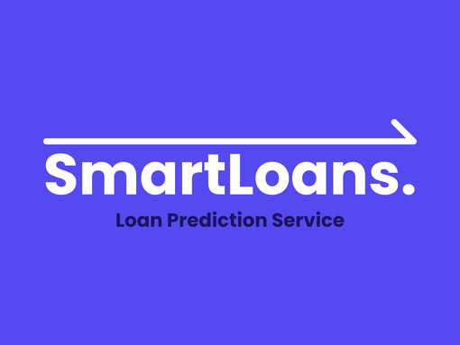
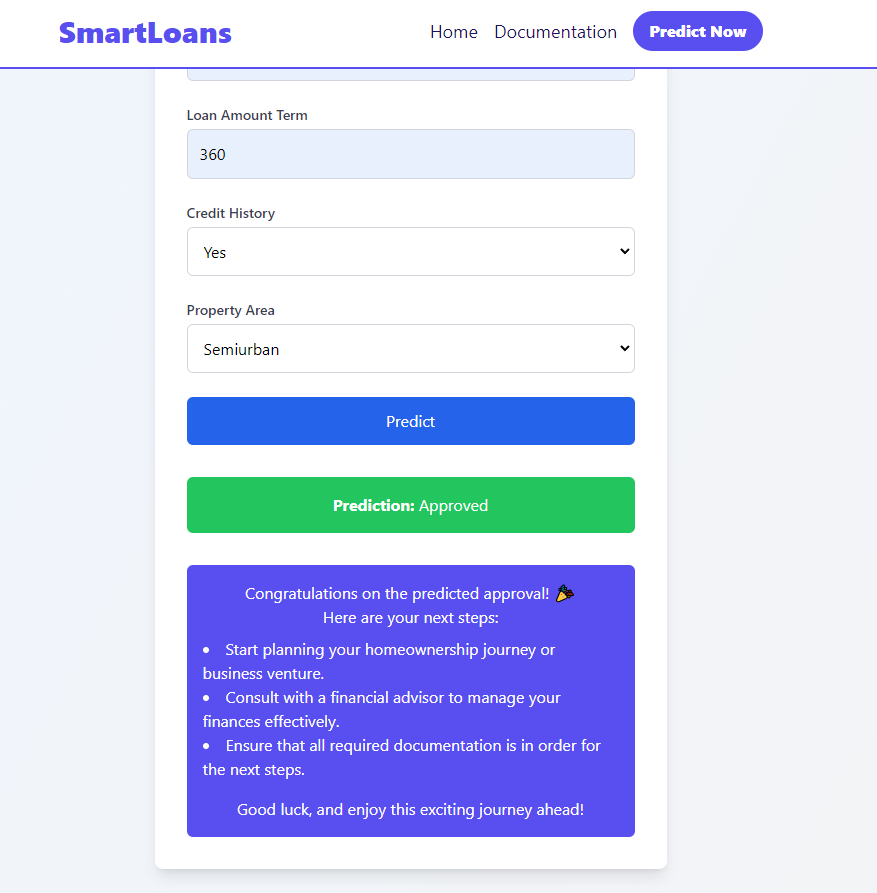
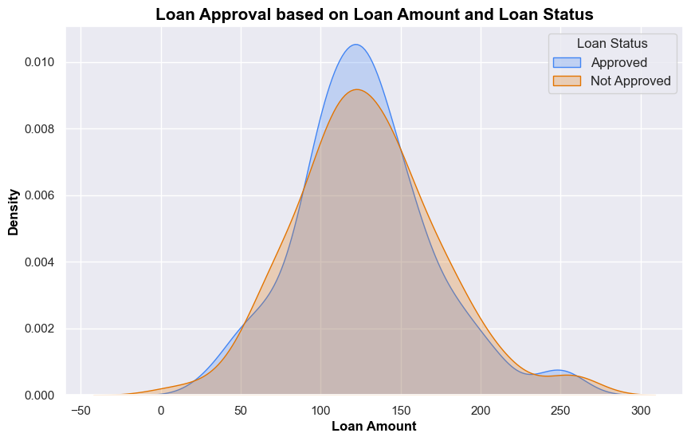
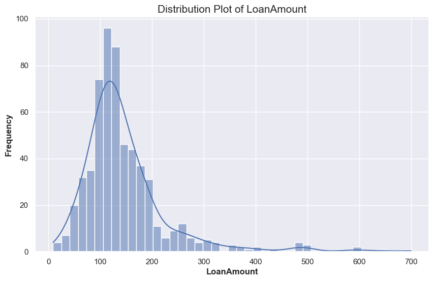
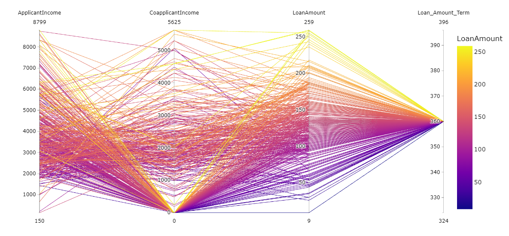
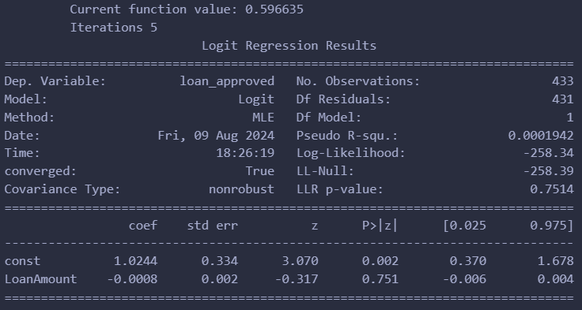

  

## **Description**

SmartLoans was developed as a tool that simplifies loan eligibility assessments using a trained machine learning model, to enhance my data analysis and backend development ability. This project built on my frontend expertise and provided hands-on experience with API connections and backend processing, bridging data science with user-facing applications. It was the first time I had worked with exploratory data analysis and training a model given a dataset.

## **Table of Contents**

- [Features](#features)
- [Jupyter Notebook](#jupyter-notebook)
- [License](#license)
- [Acknowledgements](#acknowledgements)

## **Features**

- **Machine Learning Model** SmartLoans utilizes a cutting-edge machine learning model trained on a robust Kaggle dataset. This model has trained to deliver highly accurate loan eligibility predictions, ensuring reliable assessments based on diverse financial profiles.
- **Comprehensive Data Analysis** The tool incorporates advanced exploratory data analysis (EDA) techniques, offering deep insights into financial data trends. This empowers users to understand the factors influencing their loan eligibility, providing a transparent and data-driven decision-making process.

- **Seamless API Integration:** SmartLoans bridges the gap between data science and user experience through seamless API integration. This enables real-time processing and instant feedback, allowing users to quickly assess their loan eligibility and make informed financial decisions.

## **Jupyter Notebook**

### **Overview**

This Jupyter notebook guides you through a complete loan eligibility analysis, from data exploration to model training. It leverages advanced exploratory data analysis (EDA) and machine learning techniques to build a predictive model. Please see acknowledgements for resources used.

### **Data Analysis and Preparation**

- **Exploration:** The notebook starts with univariate, bivariate, and multivariate analyses to uncover patterns and relationships in the data. This step is crucial for understanding how different factors might influence loan eligibility.

- **Cleaning:** Missing values are handled with imputation, and outliers are analyzed to ensure a clean, accurate dataset.

- **Statistical Testing:** Various statistical tests validate assumptions about the data, laying the groundwork for reliable modeling.

### **Preprocessing and Feature Engineering**

- **Encoding and Selection:** Categorical variables are encoded using LabelEncoders, and feature importance metrics are used to select the most impactful variables, streamlining the model for better performance.

### **Model Training and Evaluation**

- **Building the Model:** A machine learning model is trained to predict loan eligibility, with careful attention to balancing the dataset to avoid biased outcomes.

- **Results:** The notebook concludes with an analysis of feature importance and model performance, offering insights into which factors most strongly influence eligibility.

## **Testing**

- To activate the backend: `cd backend` `python app.py`
- To activate frontend: `cd frontend` `npm run dev`
- Note: If testing locally, make sure to change the API endpoints

## **License**

- This project is licensed under the [MIT License](LICENSE)

## **Acknowledgements**

- **Guide Credit:** This project’s Jupyter notebook was heavily inspired by and built upon the concepts learned from the following guide: [Mastering Loan Eligibility Analysis - Advance EDA by Talha Bukhari](https://www.kaggle.com/code/talhabu/mastering-loan-eligibility-analysis-advance-eda?scriptVersionId=126121065). The guide was instrumental in helping me understand exploratory data analysis and training a machine learning model.
- Special thanks to the Kaggle community for providing valuable resources and datasets.
